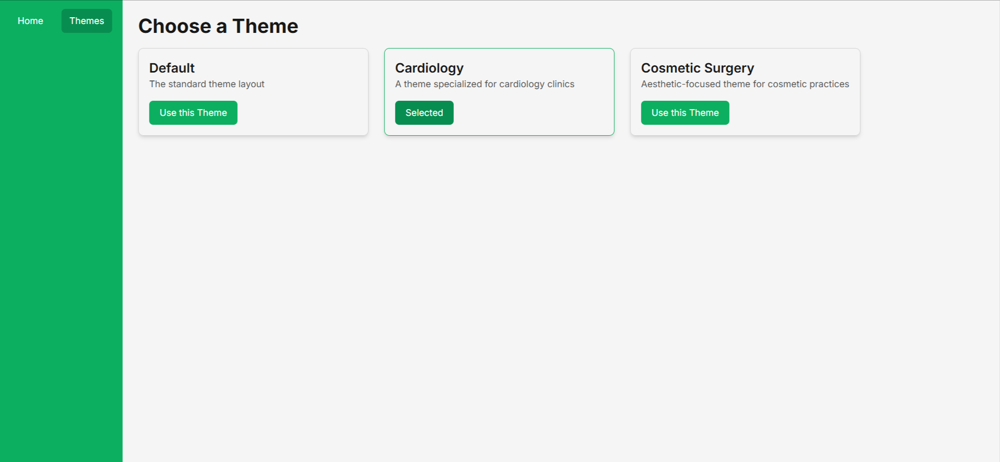

#  Documentation of the GoGetWell.ai Theme System Implementation – Assignment #2

## 📝 Implementation details

- Forked the repository.
- git clone the project.
- go to the project directory and npm i.
- Create Caddyfile
- Create docker-compose.yml file
- run docker desktop in my local machine
- run docker compose command
- npm run dev
- have tested the subdomains. working properly.
- update the themeStore.ts as told
- created the Menu Bar component as told and make it visible in the ui
- created the themes page which have 3 cards, each card represent a particular theme. If user select a card of a particular theme whole website will change to that theme instantly.
- create 3 color.ts file for my default theme, theme1 and theme2.
- in theme.config.ts file I have imported these color files to presetThemeSchemaConfig which I will traverse to switch between themes.
- I have created the ThemeProvider file and wrap our app with it so that if I change my theme with the help of this component whole app can change.
- I have created ThemeSwitcher component which will allow used to switch between themes inside the application.
- Now when user go to the Themes page from the Menu Bar and select a theme instantly he will see all the page changes to that particular theme. Even if he refreshes the page the selected theme of persist because here Zustand Persists Middleware is used which saves our theme state to our localstorage.

---

## 🛠️ Theme Customization Guideline

- User can select different themes from the themes page.
- Developer can change the theme color form src/views/themes which have base (default color), theme1 (has color for cardiology) and theme2 (has color for cosmetology). Developer can change the color and make other changes if necessary. 

---

## ✅ Screenshots

### Default Theme Home

### Default Theme Selection

### Organ Transplant Theme Home

### Organ Transplant Theme Selection

### Cosmetic Theme Home

### Cosmetic Theme Selection

