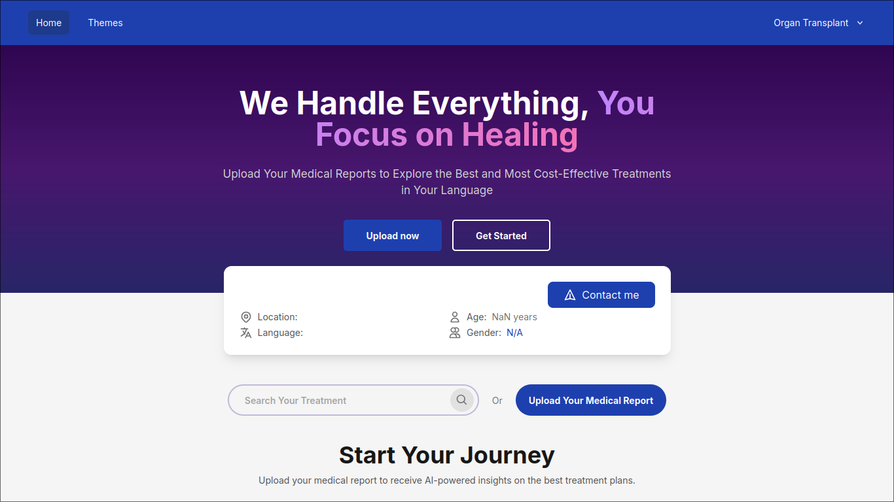
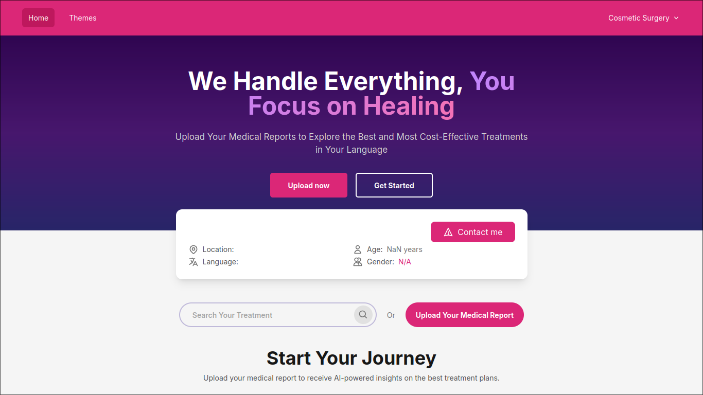

# ✅ GoGetWell.ai – Multi-Theme System Implementation

## 🏁 Assignment Completed

This repository contains a completed implementation of a comprehensive multi-theme system for GoGetWell.ai, tailored to medical specialties like Organ Transplant and Cosmetic Surgery.

---

## ✅ Features Implemented

### 1. 🌐 Themes Page
- Created `/themes` page to preview and select different medical specialty themes.

### 2. 🎨 Specialty-Based Theming
- Implemented 2 unique themes:
  - **Organ Transplant**
  - **Cosmetic Surgery**
- Each theme customizes:
  - Colors (primary, deep, mild)
  - Typography (font-family, size, weight)
  - Global CSS variables

### 3. 🧠 Zustand Theme Store
- State managed using Zustand with persistent localStorage.
- Tracks selected theme (`specialty`) and layout preferences.

### 4. ⚙️ ThemeProvider
- Dynamically injects CSS variables for color and typography.
- Clears old styles and cleanly applies new ones per theme.

### 5. 🌀 Tailwind Integration
- Tailwind extended to support:
  - `--primary`, `--primary-deep`, `--primary-mild`
  - `--font-family` via `font-base` class

---

## 🖼️ Screenshots

### 🌿 Organ Transplant Theme

### 💄 Cosmetic Surgery Theme

---
